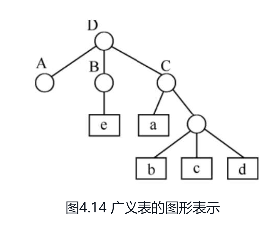
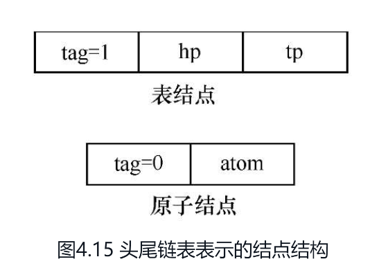
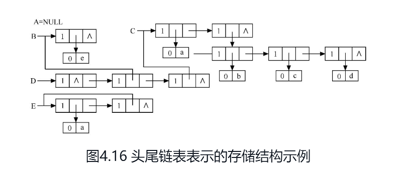
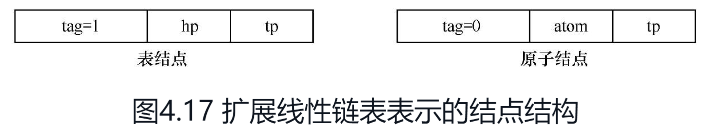

# 串

串（string）（或字符串）是由零个或多个字符组成的有限序列，一般记为


其中，s是串的名，用双引号括起来的字符序列是串的值；$$ai(1≤i≤n)$$可以是字母、数字或其他字符；串中字符的数目n称为串的长度。**零个字符的串称为空串（null string），其长度为零。**

串中任意个连续的字符组成的子序列称为该串的**子串**。包含子串的串相应地称为主串。通常称字符在序列中的序号为该字符在串中的**位置**。子串在主串中的位置则以子串的第一个字符在主串中的位置来表示。

例如，假设a、b、c、d为如下的4个串：


则它们的长度分别为3、4、7和8；并且a和b都是c和d的子串，a在c和d中的位置都是1，而b在c中的位置是4，在d中的位置则是5。

称两个串是相等的，当且仅当这两个串的值相等。

也就是说，**只有当两个串的长度相等，并且各个对应位置的字符都相等时才相等。**例如，上例中的串a、b、c和d彼此都不相等。

在各种应用中，空格常常是串的字符集合中的一个元素；因而可以出现在其他字符中间。由一个或多个空格组成的串“ ”称为空格串（blank string，请注意：此处不是空串），其长度为串中空格字符的个数。为了清楚起见，以后我们用符号“Ø”来表示“空串”。


# 串的类型定义、存储结构及其运算

## 串的抽象类型定义

串的逻辑结构和线性表极为相似，区别仅在于串的数据对象约束为字符集。然而，串的基本操作和线性表有很大差别。在线性表的基本操作中，大多以“单个元素”作为操作对象，例如，在线性表中查找某个元素，求取某个元素，在某个位置上插入一个元素或删除一个元素等；而在串的基本操作中，通常以“串的整体”作为操作对象，例如，在串中查找某个子串，求取一个子串，在串的某个位置上插入一个子串，以及删除一个子串等。


## 串的存储结构

与线性表类似，串也有两种基本存储结构：顺序存储和链式存储。

但考虑到存储效率和算法的方便性，**串多采用顺序存储结构。**


### 串的顺序存储

 C 语言中，我们通常使用字符数组来表示字符串，并将其存储在连续的内存空间中，这被称为串的顺序存储。

假设我们要存储一个长度为 n 的字符串 s，我们可以声明一个字符数组 char s[n+1]，其中 n+1 表示数组大小，多出来的一个位置用于存储字符串的结束标记 '\0'。

例如，如果我们要存储字符串 "hello"，我们可以这样声明数组：

```c
char s[6] = "hello";
```

注意，字符串常量在 C 语言中是以 '\0' 结尾的字符数组，所以我们不需要显式地在字符串末尾加上 '\0'。

我们可以通过下标访问字符数组中的每个元素，例如：

```c
char c = s[0]; // 获取第一个字符 'h'
s[1] = 'a';    // 修改第二个字符为 'a'
```

需要注意的是，我们应该在访问字符数组元素之前确保下标不会越界。另外，在修改字符串时，我们需要保证字符数组有足够的空间来存储修改后的字符串。

顺序存储是字符串的一种常见存储方式，但在实际应用中也存在一些缺点，例如删除或插入操作时需要移动大量的字符，效率比较低下。在这种情况下，链式存储可能更为适用。


### 串的链式存储

当用链表表示串时，每个结点存储的是一个字符。将这些结点按顺序链接起来，就形成了一个串。这种表示方法称为串的链式存储。

串的链式存储结构可以定义为：

```c
typedef struct StringNode {
    char data;
    struct StringNode *next;
} StringNode, *String;
```

其中，`data` 是字符类型，用于存储每个字符的值；`next` 是指向下一个结点的指针，用于实现链表。

在串的链式存储结构中，字符串的首地址为链表的头指针，即 `String` 类型的变量。链表的最后一个结点的 `next` 指针为 `NULL`，表示链表的结束。

下面是一个示例程序，用于实现串的链式存储：

```c
#include <stdio.h>
#include <stdlib.h>

typedef struct StringNode {
    char data;
    struct StringNode *next;
} StringNode, *String;

void strInit(String *str) {
    *str = (String) malloc(sizeof(StringNode));
    (*str)->next = NULL;
}

void strInsert(String str, int pos, char ch) {
    StringNode *p, *q;
    int i;

    p = str;
    for (i = 0; i < pos && p->next != NULL; i++) {
        p = p->next;
    }

    q = (StringNode *) malloc(sizeof(StringNode));
    q->data = ch;
    q->next = p->next;
    p->next = q;
}

void strPrint(String str) {
    StringNode *p;

    p = str->next;
    while (p != NULL) {
        printf("%c", p->data);
        p = p->next;
    }
    printf("\n");
}

int main() {
    String str;
    strInit(&str);

    strInsert(str, 0, 'H');
    strInsert(str, 1, 'e');
    strInsert(str, 2, 'l');
    strInsert(str, 3, 'l');
    strInsert(str, 4, 'o');
    strInsert(str, 5, ',');
    strInsert(str, 6, ' ');
    strInsert(str, 7, 'w');
    strInsert(str, 8, 'o');
    strInsert(str, 9, 'r');
    strInsert(str, 10, 'l');
    strInsert(str, 11, 'd');
    strInsert(str, 12, '!');

    strPrint(str);

    return 0;
}
```

在这个示例程序中，首先使用 `strInit()` 函数初始化了一个空串。然后使用 `strInsert()` 函数将字符一个一个插入到串中。最后使用 `strPrint()` 函数输出了整个串。

需要注意的是，串的链式存储不同于顺序存储，它的操作时间复杂度不稳定，具有一定的缺点，需要根据实际应用情况选择合适的存储方式。


###  串模式匹配算法

C语言中的串模式匹配算法用于在一个文本串中查找一个模式串的出现位置。这是一种常见的算法，常用于字符串匹配、搜索引擎、文件搜索等领域。下面介绍几种常见的C语言串的模式匹配算法，并给出相应的示例代码。

#### 暴力匹配算法

暴力匹配算法是一种朴素的字符串匹配算法，它的思路很简单，就是逐个比较文本串和模式串的每个字符，如果匹配失败就回溯到文本串的下一个字符，直到找到匹配的位置或者到达文本串的末尾。

下面是暴力匹配算法的示例代码：

```c
#include <stdio.h>
#include <string.h>

int match(char* text, char* pattern)
{
    int i, j, n = strlen(text), m = strlen(pattern);
    for (i = 0; i <= n - m; i++) {
        for (j = 0; j < m && text[i + j] == pattern[j]; j++);
        if (j == m) return i;
    }
    return -1;
}

int main()
{
    char text[] = "hello, world";
    char pattern[] = "world";
    int pos = match(text, pattern);
    if (pos >= 0) {
        printf("Found pattern at position %d\n", pos);
    } else {
        printf("Pattern not found\n");
    }
    return 0;
}
```


#### KMP算法

KMP算法是一种高效的字符串匹配算法，它利用模式串本身的信息来加速匹配过程。具体地，KMP算法维护一个部分匹配表，用来记录模式串中每个前缀的最长公共前缀长度，然后利用这个表来跳过一些不必要的比较，从而加速匹配过程。

下面是KMP算法的示例代码：

```c
#include <stdio.h>
#include <string.h>

void precompute(char* pattern, int* pi)
{
    int m = strlen(pattern);
    pi[0] = 0;
    for (int i = 1, j = 0; i < m; i++) 
    {
        while (j > 0 && pattern[i] != pattern[j]) 
        {
            j = pi[j - 1];
        }
        if (pattern[i] == pattern[j])
        {
            j++;
        }
        pi[i] = j;
    }
}

int match(char* text, char* pattern)
{
    int n = strlen(text), m = strlen(pattern);
    int* pi = (int*)malloc(m * sizeof(int));
    precompute(pattern, pi);
    for (int i = 0, j = 0; i < n; i++) 
    {
        while (j > 0 && text[i] != pattern[j]) 
        {
            j = pi[j - 1];
        }
        if (text[i] == pattern[j]) 
        {
            j++;
        }
        if (j == m) 
        {
            free(pi);
            return i - m + 1;
        }
}
free
```


# 广义表

## 广义表的定义

广义表一般记作
$$
LS=(a1,a2,…,an)
$$
其中，LS是广义表（a1, a2,…,an）的名称，n是其长度。在线性表的定义中，ai（1≤i≤n）只限于是单个元素。而在广义表的定义中，ai可以是单个元素，也可以是广义表，分别称为广义表LS的原子和子表。习惯上，用大写字母表示广义表的名称，用小写字母表示原子。

显然，广义表的定义是一个递归的定义，因为在描述广义表时又用到了广义表的概念。下面列举一些广义表的例子。

（1）A=( )—A是一个空表，其长度为零。

（2）B=(e)—B只有一个原子e，其长度为1。

（3）C=(a, (b, c, d))—C的长度为2，两个元素分别为原子a和子表(b, c, d)。

（4）D=(A, B, C)—D的长度为3，3个元素都是广义表。显然，将子表的值代入后，则有D=(( ), (e)，(a, (b, c, d)))。

（5）E=(a, E)—这是一个递归的表，其长度为2。E相当于一个无限的广义表E=(a，(a, (a, …)))。


从上述定义和例子可推出广义表的如下3个重要结论。

（1）广义表的元素可以是子表，而子表的元素还可以是子表……由此，广义表是一个多层次的结构，可以用图形象地表示。例如，图4.14表示的是广义表D，图中以圆圈表示广义表，以方块表示原子。



（2）广义表可为其他广义表所共享。

例如在上述例子中，广义表A、B和C为D的子表，则在D中可以不必列出子表的值，而是通过子表的名称来引用。

（3）广义表可以是一个递归的表，即广义表也可以是其本身的一个子表。例如，表E就是一个递归的表。


由于广义表的结构比较复杂，其各种运算的实现也不如线性表简单，其中，最重要的两个运算如下。

（1）取表头GetHead(LS)：取出的表头为非空广义表的第一个元素，它可以是一个单原子，也可以是一个子表。

（2）取表尾GetTail(LS)：取出的表尾为除去表头之外，由其余元素构成的表。即表尾一定是一个广义表。例如：GetHead(B)=e，GetTail(B)=( )，GetHead(D)=A，GetTail(D)=(B，C),由于(B,C)为非空广义表，则可继续分解得到：GetHead(B，C)=B，GetTail(B，C)=(C)，值得提醒的是，广义表( )和(( ))不同。前者为空表，长度n=0；后者长度n=1，可分解得到其表头、表尾均为空表( )。


## 广义表的存储结构

由于广义表中的数据元素可以有不同的结构（或是原子，或是列表），因此难以用顺序存储结构表示，通常采用链式存储结构。常用的链式存储结构有两种，头尾链表的存储结构和扩展线性链表的存储结构。

### 头尾链表的存储结构

由于广义表中的数据元素可能为原子或广义表，由此需要两种结构的结点：

- 一种是**表结点**，用以表示广义表；

- 一种是**原子结点**，用以表示原子。

从上节得知：若广义表不空，则可分解成表头和表尾，因此，一对确定的表头和表尾可唯一确定广义表。

一个表结点可由3个域组成：**标志域**、指示**表头的指针域**和指示**表尾的指针域**。而**原子结点只需两个域：标志域和值域**。

如图4.15所示，其中tag是标志域，值为1时表明结点是子表，值为0时表明结点是原子。





上节中曾列举了广义表的例子，它们的存储结构如图4.16所示，在这种存储结构中有以下几种情况。



（1）除空表的表头指针为空外，对任何非空广义表，其表头指针均指向一个表结点，且该结点中的hp域指示广义表表头（或为原子结点，或为表结点），tp域指向广义表表尾（除非表尾为空，则指针为空，否则必为表结点）。

（2）容易分清列表中原子和子表所在层次。如在广义表D中，原子a和e在同一层次上，而b、c和d在同一层次且比a和e低一层，B和C是同一层的子表。

（3）**最高层的表结点个数即为广义表的长度**。以上3个特点在某种程度上给广义表的操作带来方便。


### 扩展线性链表的存储结构

在这种结构中，无论是原子结点还是表结点均由三个域组成，其结点结构如图4.17所示




## 广义表的c语言实现

C语言本身并没有提供广义表（Generalized List）这种数据结构，但是可以通过指针和结构体来实现广义表。

广义表是由多个元素组成的序列，每个元素可以是一个原子元素或者另一个广义表。因此，广义表是一个递归的数据结构。

在C语言中，我们可以用结构体来定义广义表。一个广义表结构体可以包含两个指针，一个指向当前元素，另一个指向下一个元素。如果当前元素是一个原子元素，则第一个指针指向该元素，如果当前元素是一个广义表，则第一个指针指向该广义表的头节点。

下面是一个简单的广义表结构体的定义：

```c
struct GLNode {
    int tag;  // 标记当前元素是原子元素还是广义表
    union {
        char data;  // 当前元素是原子元素时，存储该元素的值
        struct GLNode* hp;  // 当前元素是广义表时，指向该广义表的头节点
    } atom_next;
    struct GLNode* tp;  // 指向下一个元素
};
```

这个结构体包含三个成员：**tag**表示当前元素是原子元素还是广义表，**atom_next** 是一个联合体，如果当前元素是原子元素，则存储该元素的值，否则存储指向该广义表的头节点的指针。**tp**指向下一个元素。

利用这个结构体，我们可以实现广义表的创建、遍历、求值等操作。例如，下面是一个创建广义表的函数：

```c
struct GLNode* CreateGL(char* s) {
    struct GLNode* p, * q, * head;
    char c;
    head = (struct GLNode*)malloc(sizeof(struct GLNode));
    q = head;
    while (*s) {
        c = *s++;
        p = (struct GLNode*)malloc(sizeof(struct GLNode));
        if (c == '(') {
            p->tag = 1;  // 当前元素是广义表
            p->atom_next.hp = CreateGL(s);
            while (*s++ != ')');  // 跳过广义表尾部的')'
        } else if (c == ',') {
            continue;  // 跳过逗号
        } else if (c == ')') {
            break;  // 当前广义表处理完毕
        } else {
            p->tag = 0;  // 当前元素是原子元素
            p->atom_next.data = c;
        }
        q->tp = p;
        q = p;
    }
    q->tp = NULL;  // 最后一个元素的指针为空
    return head;
}
```

这个函数的参数是一个字符串，表示一个广义表的序列。它会递归地创建广义表，并返回该广义表的头节点。


```c
typedef struct GLNode{
    int tag; // tag 为 0 表示该元素是原子，为 1 表示该元素是子表
    union{
        char data; // 原子元素的数据域
        struct GLNode *subList; // 子表指针
    }val;
    struct GLNode *next; // 指向后继结点的指针
}GLNode, *GList;

// 初始化广义表
void InitGList(GList *L){
    *L = NULL;
}

// 创建广义表
void CreateGList(GList *L, char *s){
    GList p, q;
    int k, len = strlen(s);
    *L = (GList)malloc(sizeof(GLNode));
    p = *L;
    k = 0;
    while(k < len){
        if(s[k] == '('){ // 创建子表
            q = (GList)malloc(sizeof(GLNode));
            q->tag = 1;
            p->val.subList = q;
            p = q;
        }
        else if(s[k] == ')'){ // 子表结束
            p = (*L)->next;
        }
        else if(s[k] == ','){ // 分隔元素
            p->next = (GList)malloc(sizeof(GLNode));
            p->next->tag = 0;
            p = p->next;
        }
        else{ // 创建原子元素
            p->tag = 0;
            p->val.data = s[k];
            p->next = (GList)malloc(sizeof(GLNode));
            p = p->next;
        }
        k++;
    }
    p = NULL;
}

// 访问广义表元素
void GetElem(GList L, int i, char *e){
    GList p = L;
    int j = 1;
    while(p && j < i){
        p = p->next;
        j++;
    }
    if(!p || p->tag == 1 || j > i){ // 非原子元素或 i 不合法
        e = NULL;
    }
    else{
        *e = p->val.data;
    }
}

// 销毁广义表
void DestroyGList(GList *L){
    GList p = *L, q;
    while(p){
        if(p->tag == 1){ // 子表
            DestroyGList(&p->val.subList);
        }
        q = p;
        p = p->next;
        free(q);
    }
    *L = NULL;
}
```


完整例子

```c
#include <stdio.h>
#include <stdlib.h>

struct node 
{
    int tag;            // 标记，0表示数据项，1表示子表
    union 
    {
        int data;       // 数据项
        struct node* subList;   // 子表指针
    }u;
    struct node* next;  // 下一个节点指针
};

typedef struct node* List;   // 定义广义表类型

// 创建一个广义表节点
List createNode(int tag, int data, List subList, List nextNode)
{
    List node = (List) malloc(sizeof(struct node));
    node->tag = tag;
    if(tag == 0) 
    {
        node->u.data = data;
    } else if(tag == 1) 
    {
        node->u.subList = subList;
    }
    node->next = nextNode;
    return node;
}

// 打印广义表
void printList(List L) 
{
    if(L == NULL) 
    {
        printf("()");
        return;
    }
    printf("(");
    while(L != NULL)
    {
        if(L->tag == 0) 
        {
            printf("%d", L->u.data);
            if(L->next != NULL && L->next->tag != 1) 
            {
                printf(", ");
            }
        } 
        else if(L->tag == 1) 
        {
            printList(L->u.subList);
            if(L->next != NULL && L->next->tag != 1) 
            {
                printf(", ");
            }
        }
        L = L->next;
    }
    printf(")");
}

int main() 
{
    List L = createNode(1, 0, NULL, createNode(0, 1, NULL, createNode(1, 0, createNode(0, 2, NULL, NULL), createNode(1, 0, createNode(0, 3, NULL, NULL), createNode(0, 4, NULL, NULL)))));
    // 创建广义表 (1, (2, 3), 4)
    printList(L);   // 输出：(1, (2, 3), 4)
    return 0;
}
```

在这个示例中，`struct node`表示广义表节点，其中`tag`表示标记，`data`表示数据项，`subList`表示子表指针，`next`表示下一个节点指针。`createNode`函数用来创建一个广义表节点，根据标记的不同分别存储数据项或子表指针。`printList`函数用来打印广义表，遍历广义表节点并根据标记输出数据项或递归输出子表。在`main`函数中，创建了一个广义表`(1, (2, 3), 4)`，并输出结果`(1, (2, 3), 4)`。