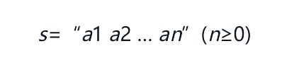
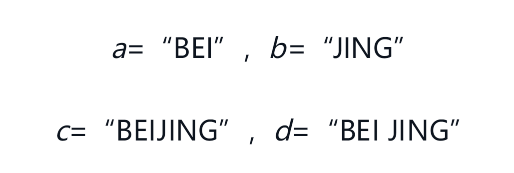

# 串

串（string）（或字符串）是由零个或多个字符组成的有限序列，一般记为



其中，s是串的名，用双引号括起来的字符序列是串的值；$$ai(1≤i≤n)$$可以是字母、数字或其他字符；串中字符的数目n称为串的长度。**零个字符的串称为空串（null string），其长度为零。**

串中任意个连续的字符组成的子序列称为该串的**子串**。包含子串的串相应地称为主串。通常称字符在序列中的序号为该字符在串中的**位置**。子串在主串中的位置则以子串的第一个字符在主串中的位置来表示。

例如，假设a、b、c、d为如下的4个串：



则它们的长度分别为3、4、7和8；并且a和b都是c和d的子串，a在c和d中的位置都是1，而b在c中的位置是4，在d中的位置则是5。

称两个串是相等的，当且仅当这两个串的值相等。

也就是说，**只有当两个串的长度相等，并且各个对应位置的字符都相等时才相等。**例如，上例中的串a、b、c和d彼此都不相等。

在各种应用中，空格常常是串的字符集合中的一个元素；因而可以出现在其他字符中间。由一个或多个空格组成的串“ ”称为空格串（blank string，请注意：此处不是空串），其长度为串中空格字符的个数。为了清楚起见，以后我们用符号“Ø”来表示“空串”。


# 串的类型定义、存储结构及其运算

## 串的抽象类型定义

串的逻辑结构和线性表极为相似，区别仅在于串的数据对象约束为字符集。然而，串的基本操作和线性表有很大差别。在线性表的基本操作中，大多以“单个元素”作为操作对象，例如，在线性表中查找某个元素，求取某个元素，在某个位置上插入一个元素或删除一个元素等；而在串的基本操作中，通常以“串的整体”作为操作对象，例如，在串中查找某个子串，求取一个子串，在串的某个位置上插入一个子串，以及删除一个子串等。


## 串的存储结构

与线性表类似，串也有两种基本存储结构：顺序存储和链式存储。

但考虑到存储效率和算法的方便性，**串多采用顺序存储结构。**


### 串的顺序存储

 C 语言中，我们通常使用字符数组来表示字符串，并将其存储在连续的内存空间中，这被称为串的顺序存储。

假设我们要存储一个长度为 n 的字符串 s，我们可以声明一个字符数组 char s[n+1]，其中 n+1 表示数组大小，多出来的一个位置用于存储字符串的结束标记 '\0'。

例如，如果我们要存储字符串 "hello"，我们可以这样声明数组：

```c
char s[6] = "hello";
```

注意，字符串常量在 C 语言中是以 '\0' 结尾的字符数组，所以我们不需要显式地在字符串末尾加上 '\0'。

我们可以通过下标访问字符数组中的每个元素，例如：

```c
char c = s[0]; // 获取第一个字符 'h'
s[1] = 'a';    // 修改第二个字符为 'a'
```

需要注意的是，我们应该在访问字符数组元素之前确保下标不会越界。另外，在修改字符串时，我们需要保证字符数组有足够的空间来存储修改后的字符串。

顺序存储是字符串的一种常见存储方式，但在实际应用中也存在一些缺点，例如删除或插入操作时需要移动大量的字符，效率比较低下。在这种情况下，链式存储可能更为适用。


### 串的链式存储

当用链表表示串时，每个结点存储的是一个字符。将这些结点按顺序链接起来，就形成了一个串。这种表示方法称为串的链式存储。

串的链式存储结构可以定义为：

```c
typedef struct StringNode {
    char data;
    struct StringNode *next;
} StringNode, *String;
```

其中，`data` 是字符类型，用于存储每个字符的值；`next` 是指向下一个结点的指针，用于实现链表。

在串的链式存储结构中，字符串的首地址为链表的头指针，即 `String` 类型的变量。链表的最后一个结点的 `next` 指针为 `NULL`，表示链表的结束。

下面是一个示例程序，用于实现串的链式存储：

```c
#include <stdio.h>
#include <stdlib.h>

typedef struct StringNode {
    char data;
    struct StringNode *next;
} StringNode, *String;

void strInit(String *str) {
    *str = (String) malloc(sizeof(StringNode));
    (*str)->next = NULL;
}

void strInsert(String str, int pos, char ch) {
    StringNode *p, *q;
    int i;

    p = str;
    for (i = 0; i < pos && p->next != NULL; i++) {
        p = p->next;
    }

    q = (StringNode *) malloc(sizeof(StringNode));
    q->data = ch;
    q->next = p->next;
    p->next = q;
}

void strPrint(String str) {
    StringNode *p;

    p = str->next;
    while (p != NULL) {
        printf("%c", p->data);
        p = p->next;
    }
    printf("\n");
}

int main() {
    String str;
    strInit(&str);

    strInsert(str, 0, 'H');
    strInsert(str, 1, 'e');
    strInsert(str, 2, 'l');
    strInsert(str, 3, 'l');
    strInsert(str, 4, 'o');
    strInsert(str, 5, ',');
    strInsert(str, 6, ' ');
    strInsert(str, 7, 'w');
    strInsert(str, 8, 'o');
    strInsert(str, 9, 'r');
    strInsert(str, 10, 'l');
    strInsert(str, 11, 'd');
    strInsert(str, 12, '!');

    strPrint(str);

    return 0;
}
```

在这个示例程序中，首先使用 `strInit()` 函数初始化了一个空串。然后使用 `strInsert()` 函数将字符一个一个插入到串中。最后使用 `strPrint()` 函数输出了整个串。

需要注意的是，串的链式存储不同于顺序存储，它的操作时间复杂度不稳定，具有一定的缺点，需要根据实际应用情况选择合适的存储方式。


###  串模式匹配算法

C语言中的串模式匹配算法用于在一个文本串中查找一个模式串的出现位置。这是一种常见的算法，常用于字符串匹配、搜索引擎、文件搜索等领域。下面介绍几种常见的C语言串的模式匹配算法，并给出相应的示例代码。

#### 暴力匹配算法

暴力匹配算法是一种朴素的字符串匹配算法，它的思路很简单，就是逐个比较文本串和模式串的每个字符，如果匹配失败就回溯到文本串的下一个字符，直到找到匹配的位置或者到达文本串的末尾。

下面是暴力匹配算法的示例代码：

```c
#include <stdio.h>
#include <string.h>

int match(char* text, char* pattern)
{
    int i, j, n = strlen(text), m = strlen(pattern);
    for (i = 0; i <= n - m; i++) {
        for (j = 0; j < m && text[i + j] == pattern[j]; j++);
        if (j == m) return i;
    }
    return -1;
}

int main()
{
    char text[] = "hello, world";
    char pattern[] = "world";
    int pos = match(text, pattern);
    if (pos >= 0) {
        printf("Found pattern at position %d\n", pos);
    } else {
        printf("Pattern not found\n");
    }
    return 0;
}
```


#### KMP算法

KMP算法是一种高效的字符串匹配算法，它利用模式串本身的信息来加速匹配过程。具体地，KMP算法维护一个部分匹配表，用来记录模式串中每个前缀的最长公共前缀长度，然后利用这个表来跳过一些不必要的比较，从而加速匹配过程。

下面是KMP算法的示例代码：

```c
#include <stdio.h>
#include <string.h>

void precompute(char* pattern, int* pi)
{
    int m = strlen(pattern);
    pi[0] = 0;
    for (int i = 1, j = 0; i < m; i++) 
    {
        while (j > 0 && pattern[i] != pattern[j]) 
        {
            j = pi[j - 1];
        }
        if (pattern[i] == pattern[j])
        {
            j++;
        }
        pi[i] = j;
    }
}

int match(char* text, char* pattern)
{
    int n = strlen(text), m = strlen(pattern);
    int* pi = (int*)malloc(m * sizeof(int));
    precompute(pattern, pi);
    for (int i = 0, j = 0; i < n; i++) 
    {
        while (j > 0 && text[i] != pattern[j]) 
        {
            j = pi[j - 1];
        }
        if (text[i] == pattern[j]) 
        {
            j++;
        }
        if (j == m) 
        {
            free(pi);
            return i - m + 1;
        }
}
free
```

