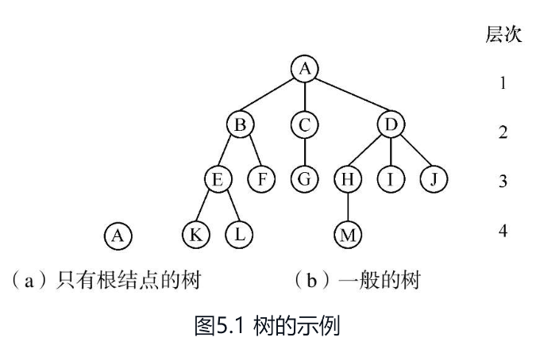
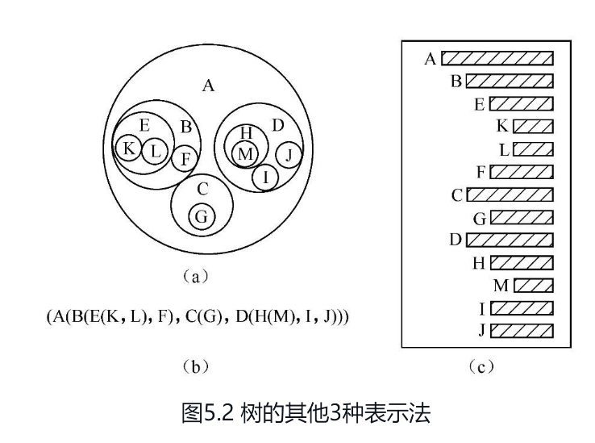
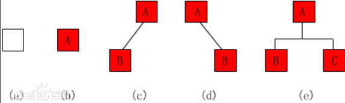

# 树的定义

树（Tree）是n（n≥0）个结点的有限集，它或为空树（n=0）；或为非空树，对于非空树T：

（1）有且仅有一个称之为根的结点；

（2）除根结点以外的其余结点可分为m（m>0）个互不相交的有限集T1, T2, …,Tm,其中每一个集合本身又是一棵树，并且称为根的子树（SubTree）。例如，在图5.1中，（a）是只有一个根结点的树；（b）是有13个结点的树，其中A是根，其余结点分成3个互不相交的子集：T1={B, E, F, K, L}，T2={C, G}，T3={D, H, I, J, M}。T1、T2和T3都是根A的子树，且本身也是一棵树。例如T1，其根为B，其余结点分为两个互不相交的子集：T11={E, K, L}，T12={F}。T11和T12都是B的子树。而T11中E是根，{K}和{L}是E的两棵互不相交的子树，其本身又是只有一个根结点的树。

树的结构定义是一个递归的定义，即在树的定义中又用到树的定义，它道出了树的固有特性。树还可有其他的表示形式，如图5.2所示为图5.1（b）中树的各种表示。

其中

（a）是以嵌套集合（即是一些集合的集体，对于其中任何两个集合，或者不相交，或者一个包含另一个）的形式表示的；

（b）是以广义表的形式表示的，根作为由子树森林组成的表的名字写在表的左边；

（c）用的是凹入表示法（类似书的编目）。表示方法的多样化，正说明了树结构在日常生活中及计算机程序设计中的重要性。一般来说，分等级的分类方案都可用层次结构来表示，也就是说，都可由一个树结构来表示。

## 树的基本术语

（1）结点：树中的一个独立单元。包含一个数据元素及若干指向其子树的分支，如图5.1（b）中的A、B、C、D等。（下面术语中均以图5.1（b）为例来说明）

（2）结点的度：结点拥有的子树数称为结点的度。例如，A的度为3，C的度为1，F的度为0。

（3）树的度：树的度是树内各结点度的最大值。图5.1（b）所示的树的度为3。

（4）叶子：度为0的结点称为叶子或终端结点。结点K、L、F、G、M、I、J都是树的叶子。

（5）非终端结点：度不为0的结点称为非终端结点或分支结点。除根结点之外，非终端结点也称为内部结点。

# 二叉树的定义

二叉树（Binary Tree）是n（n≥0）个结点所构成的集合，它或为空树（n=0）；或为非空树，对于非空树T：

（1）有且仅有一个称之为根的结点；

（2）除根结点以外的其余结点分为两个互不相交的子集T1和T2，分别称为T的左子树和右子树，且T1和T2本身又都是二叉树。二叉树与

树一样具有递归性质，二叉树与树的区别主要有以下两点：

（1）二叉树每个结点至多只有两棵子树（即二叉树中不存在度大于2的结点）；

（2）二叉树的子树有左右之分，其次序不能任意颠倒。二叉树的递归定义表明二叉树或为空，或是由一个根结点加上两棵分别称为左子树和右子树的、互不相交的二叉树组成。由于这两棵子树也是二叉树，则由二叉树的定义，它们也可以是空树。由此，二叉树可以有5种基本形态，如图5.3所示。

1、空二叉树——如图1（a）；

2、只有一个根节点的二叉树——如图1（b） ；

3、只有左子树——如图1（c） ；

4、只有右子树——如图1（d）；

5、[完全二叉树](https://baike.baidu.com/item/完全二叉树?fromModule=lemma_inlink)——如图1（e）；