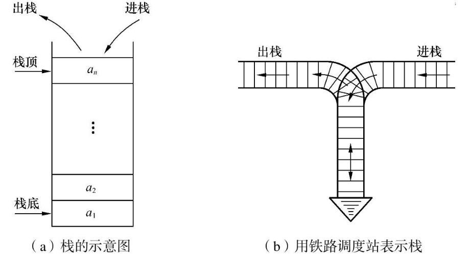

# 栈和队列的定义和特点

## 栈的定义和特点

栈（stack）是限定仅在表尾进行插入或删除操作的线性表。因此，对栈来说，表尾端有其特殊含义，称为栈顶（top），相应地，表头端称为栈底（bottom）。不含元素的空表称为空栈。假设栈$$S=(a1, a2, …, an)$$，则称$$a1$$为栈底元素，$$an$$为栈顶元素。栈中元素按$$a1, a2,…, an$$的次序进栈，退栈的第一个元素应为栈顶元素。换句话说，栈的修改是按后进先出的原则进行的，如图3.1（a）所示。因此，栈又称为后进先出（Last In First Out，LIFO）的线性表，它的这个特点可用图3.1（b）所示的铁路调度站形象地表示。

​																											图3-1