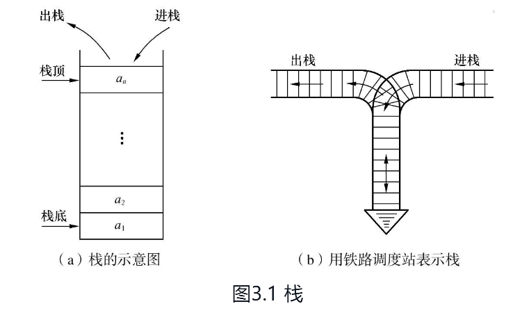
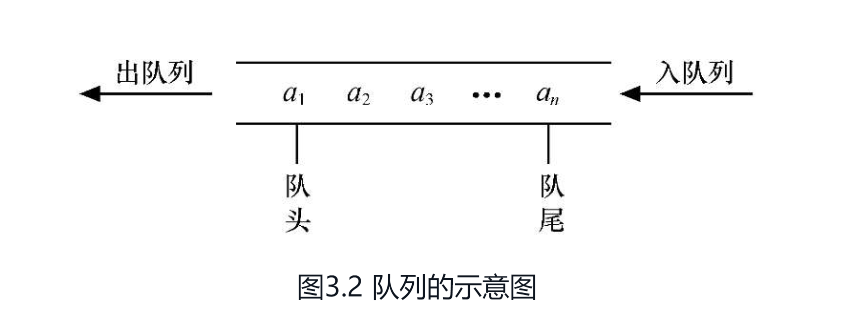
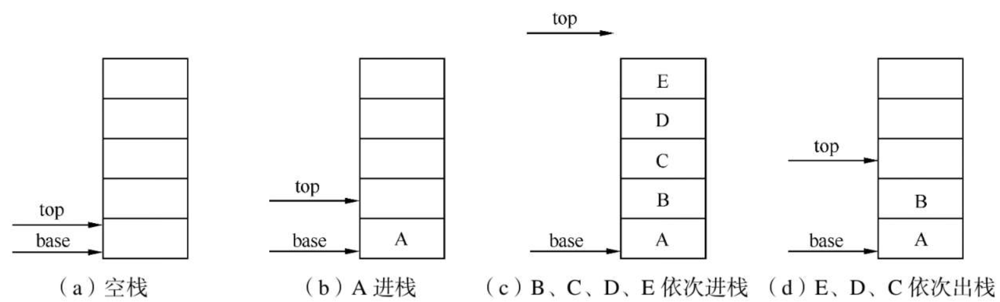
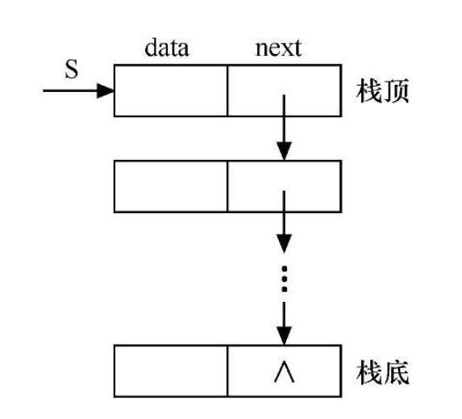
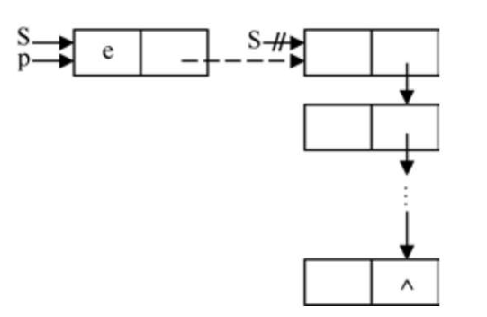

# 栈和队列的定义和特点

## 栈的定义和特点

**栈（stack）**是限定仅在表尾进行插入或删除操作的线性表。因此，对栈来说，**表尾端**有其特殊含义，称为**栈顶（top）**，相应地，**表头端**称为**栈底（bottom）**。不含元素的空表称为**空栈**。

假设栈$$S=(a1, a2, …, an)$$，则称$$a1$$为栈底元素，$$an$$为栈顶元素。栈中元素按$$a1, a2,…, an$$的次序进栈，退栈的第一个元素应为栈顶元素。换句话说，栈的修改是按**后进先出（后面进栈的先出去）**的原则进行的，如图3.1（a）所示。

因此，栈又称为**后进先出**（Last In First Out，LIFO）的线性表，它的这个特点可用图3.1（b）所示的铁路调度站形象地表示。



在日常生活中，还有很多类似栈的例子。例如，洗干净的盘子总是逐个往上叠放在已经洗好的盘子上面，而用时从上往下逐个取用。栈的操作特点正是上述实际应用的抽象。

在程序设计中，如果需要**按照保存数据时相反的顺序来使用数据**，则可以利用栈来实现。


## 队列的定义和特点

和栈相反，**队列（queue）**是一种**先进先出（First In First Out，FIFO）**的线性表。

它只允许在表的一端进行插入，而在另一端删除元素。

这和日常生活中的排队是一致的，最早进入队列的元素最早离开。

在队列中，**允许插入的一端称为队尾（rear），允许删除的一端则称为队头（front）**。

假设队列为q=(a1, a2,…, an)，那么，a1就是队头元素，an则是队尾元素。队列中的元素是按照a1, a2,…, an的顺序进入的，退出队列也只能按照这个次序依次退出，也就是说，只有在a1, a2,…,an−1都离开队列之后，an才能退出队列。图3.2所示为队列的示意图。



队列在程序设计中也经常出现。一个最典型的例子就是操作系统中的作业排队。在允许多道程序运行的计算机系统中，同时有几个作业运行。如果运行的结果都需要通过通道输出，那就要按请求输入的先后次序排队。

每当通道传输完毕可以接受新的输出任务时，队头的作业先从队列中退出做输出操作。凡是申请输出的作业都从队尾进入队列。


## 栈的表示和操作的实现

### 栈的类型定义

和线性表类似，栈也有两种存储表示方法，分别称为**顺序栈和链栈**。


### 顺序栈的表现和实现

顺序栈是指利用顺序存储结构实现的栈，即利用一组地址连续的存储单元依次存放自栈底到栈顶的数据元素，同时附设指针top指示栈顶元素在顺序栈中的位置。通常习惯的做法是：以top=0表示空栈，鉴于C语言中数组的下标约定从0开始，则当以C语言作描述语言时，如此设定会带来很大不便，因此另设指针base指示栈底元素在顺序栈中的位置。

当top和base的值相等时，表示空栈。顺序栈的定义如下：

```c
//- - - - - 顺序栈的存储结构- - - - - 
#define MAXSIZE 100             
//顺序栈存储空间的初始分配量 
typedef struct 
{   
​	SElemType *base;             //栈底指针   
​	SElemType *top;              //栈顶指针  
​	int stacksize;               //栈可用的最大容量
 }SqStack；
```

（1）**base为栈底指针**，初始化完成后，栈底指针base始终指向栈底的位置，**若base的值为NULL，则表明栈结构不存在**。top为栈顶指针，其初值指向栈底。每当插入新的栈顶元素时，指针top增1；删除栈顶元素时，指针top减1。因此，栈空时，top和base的值相等，都指向栈底；栈非空时，top始终指向栈顶元素的上一个位置。

（2）**stacksize指示栈可使用的最大容量**，后面算法3.1的初始化操作为顺序栈动态分配MAXSIZE大小的数组空间，将stacksize置为MAXSIZE。




由于顺序栈的插入和删除只在栈顶进行，因此顺序栈的基本操作比顺序表要简单得多，以下给出顺序栈部分操作的实现。

当使用 C 语言实现栈（stack）数据结构时，通常使用顺序栈（sequential stack）实现。顺序栈是在数组的基础上实现的栈，栈的元素在数组中按顺序存储。

**以下是一个简单的 C 语言顺序栈实现：**

```c
#include <stdio.h>
#include <stdlib.h>

#define MAXSIZE 100 // 定义栈的最大容量

typedef struct {
    int data[MAXSIZE]; // 栈的数据部分
    int top; // 栈顶指针
} Stack;

// 初始化栈
void InitStack(Stack *s) {
    s->top = -1;
}

// 判断栈是否为空
int IsEmpty(Stack *s) {
    return s->top == -1;
}

// 判断栈是否已满
int IsFull(Stack *s) {
    return s->top == MAXSIZE - 1;
}

// 入栈
int Push(Stack *s, int x) {
    if (IsFull(s)) {
        return 0;
    }
    s->top++;
    s->data[s->top] = x;
    return 1;
}

// 出栈
int Pop(Stack *s, int *x) {
    if (IsEmpty(s)) {
        return 0;
    }
    *x = s->data[s->top];
    s->top--;
    return 1;
}

// 取栈顶元素
int GetTop(Stack *s, int *x) {
    if (IsEmpty(s)) {
        return 0;
    }
    *x = s->data[s->top];
    return 1;
}

int main() {
    Stack s;
    int x;

    InitStack(&s); // 初始化栈

    // 入栈
    Push(&s, 1);
    Push(&s, 2);
    Push(&s, 3);

    // 取栈顶元素
    GetTop(&s, &x);
    printf("栈顶元素为：%d\n", x);

    // 出栈
    while (!IsEmpty(&s)) {
        Pop(&s, &x);
        printf("%d ", x);
    }
    printf("\n");

    return 0;
}
```

在这个例子中，我们使用了一个结构体 `Stack` 来表示顺序栈，其中包含一个数组 `data` 来存储栈中的元素，以及一个整数 `top` 来表示栈顶的下标。然后我们定义了几个函数来实现栈的常用操作：

- `InitStack`：初始化栈。
- `IsEmpty`：判断栈是否为空。
- `IsFull`：判断栈是否已满。
- `Push`：将元素入栈。
- `Pop`：将元素出栈。
- `GetTop`：取栈顶元素。

在 `main` 函数中，我们首先初始化栈，然后将一些元素入栈，再取栈顶元素，并将所有元素出栈。


### 链栈的表现与实现

链栈是指采用**链式存储结构**实现的栈。通常链栈用单链表来表示，如图3.4所示。链栈的结点结构与单链表的结构相同，在此用StackNode表示，定义如下：



由于栈的主要操作是在栈顶插入和删除，显然以链表的头部作为栈顶是最方便的，而且没必要像单链表那样为了操作方便附加一个头结点。

下面给出链栈部分操作的实现。

#### **1．初始化链栈**

初始化操作就是构造一个空栈，因为没必要设头结点，所以直接将栈顶指针置空即可。**

```c
Status InitStack(LinkStack &S) 
{//构造一个空栈S，栈顶指针置空   
	S=NULL;   
	return OK; 
}
```

#### **2．入栈**

顺序栈的入栈操作不同的是**，**链栈在入栈前不需要判断栈是否满，只需要为入栈元素动态分配一个结点空间



【算法步骤】

① 为入栈元素e分配空间，用指针p指向。

② 将新结点数据域置为e。

③ 将新结点插入栈顶。

④ 修改栈顶指针为p。

```c
Status Push(LinkStack &S, SElemType e) 			//在栈顶插入元素e   
{													
	p=new StackNode;                             //生成新结点   
	p->data=e;                                   //将新结点数据域置为e   
	p->next=S;                                   //将新结点插入栈顶   
	S=p;                                         //修改栈顶指针为p   
	return OK; 
}
```


#### **3．出栈**

和顺序栈一样，链栈在出栈前也需要判断栈是否为空，不同的是，**链栈在出栈后需要释放出栈元素的栈顶空间**


【算法步骤】

① 判断栈是否为空，若空则返回ERROR。

② 将栈顶元素赋给e。

③ 临时保存栈顶元素的空间，以备释放。

④ 修改栈顶指针，指向新的栈顶元素。

⑤ 释放原栈顶元素的空间。

```c
Status Pop(LinkStack &S,SElemType &e) 					//删除S的栈顶元素，用e返回其值 
{			  
	if(S==NULL) return ERROR;                            //栈空   
	e=S->data;                                           //将栈顶元素赋给e   
	p=S;                                                 //用p临时保存栈顶元素空间，以备释放   
	S=S->next;                                           //修改栈顶指针   
	delete p;                                            //释放原栈顶元素的空间   
	return OK; 
}

```


#### **4. 取栈顶元素**

```c
SElemType GetTop(LinkStack S) //返回S的栈顶元素，不修改栈顶指针
{   
	if(S！=NULL)                  //栈非空      
	return S->data;           //返回栈顶元素的值，栈顶指针不变 
}
```

