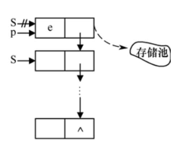

# 栈和队列的定义和特点

## 栈的定义和特点

**栈（stack）**是限定仅在表尾进行插入或删除操作的线性表。因此，对栈来说，**表尾端**有其特殊含义，称为**栈顶（top）**，相应地，**表头端**称为**栈底（bottom）**。不含元素的空表称为**空栈**。

假设栈$$S=(a1, a2, …, an)$$，则称$$a1$$为栈底元素，$$an$$为栈顶元素。栈中元素按$$a1, a2,…, an$$的次序进栈，退栈的第一个元素应为栈顶元素。换句话说，栈的修改是按**后进先出（后面进栈的先出去）**的原则进行的，如图3.1（a）所示。

因此，栈又称为**后进先出**（Last In First Out，LIFO）的线性表，它的这个特点可用图3.1（b）所示的铁路调度站形象地表示。


在日常生活中，还有很多类似栈的例子。例如，洗干净的盘子总是逐个往上叠放在已经洗好的盘子上面，而用时从上往下逐个取用。栈的操作特点正是上述实际应用的抽象。

在程序设计中，如果需要**按照保存数据时相反的顺序来使用数据**，则可以利用栈来实现。


## 队列的定义和特点

和栈相反，**队列（queue）**是一种**先进先出（First In First Out，FIFO）**的线性表。

它只允许在表的一端进行插入，而在另一端删除元素。

这和日常生活中的排队是一致的，最早进入队列的元素最早离开。

在队列中，**允许插入的一端称为队尾（rear），允许删除的一端则称为队头（front）**。

假设队列为q=(a1, a2,…, an)，那么，a1就是队头元素，an则是队尾元素。队列中的元素是按照a1, a2,…, an的顺序进入的，退出队列也只能按照这个次序依次退出，也就是说，只有在a1, a2,…,an−1都离开队列之后，an才能退出队列。图3.2所示为队列的示意图。


队列在程序设计中也经常出现。一个最典型的例子就是操作系统中的作业排队。在允许多道程序运行的计算机系统中，同时有几个作业运行。如果运行的结果都需要通过通道输出，那就要按请求输入的先后次序排队。

每当通道传输完毕可以接受新的输出任务时，队头的作业先从队列中退出做输出操作。凡是申请输出的作业都从队尾进入队列。


# 栈的表示和操作的实现

## 栈的类型定义

和线性表类似，栈也有两种存储表示方法，分别称为**顺序栈和链栈**。


## 顺序栈的表现和实现

顺序栈是指利用顺序存储结构实现的栈，即利用一组地址连续的存储单元依次存放自栈底到栈顶的数据元素，同时附设指针top指示栈顶元素在顺序栈中的位置。通常习惯的做法是：以top=0表示空栈，鉴于C语言中数组的下标约定从0开始，则当以C语言作描述语言时，如此设定会带来很大不便，因此另设指针base指示栈底元素在顺序栈中的位置。

当top和base的值相等时，表示空栈。顺序栈的定义如下：

```c
//- - - - - 顺序栈的存储结构- - - - - 
#define MAXSIZE 100             
//顺序栈存储空间的初始分配量 
typedef struct 
{   
​	SElemType *base;             //栈底指针   
​	SElemType *top;              //栈顶指针  
​	int stacksize;               //栈可用的最大容量
 }SqStack；
```

（1）**base为栈底指针**，初始化完成后，栈底指针base始终指向栈底的位置，**若base的值为NULL，则表明栈结构不存在**。top为栈顶指针，其初值指向栈底。每当插入新的栈顶元素时，指针top增1；删除栈顶元素时，指针top减1。因此，栈空时，top和base的值相等，都指向栈底；栈非空时，top始终指向栈顶元素的上一个位置。

（2）**stacksize指示栈可使用的最大容量**，后面算法3.1的初始化操作为顺序栈动态分配MAXSIZE大小的数组空间，将stacksize置为MAXSIZE。


由于顺序栈的插入和删除只在栈顶进行，因此顺序栈的基本操作比顺序表要简单得多，以下给出顺序栈部分操作的实现。

当使用 C 语言实现栈（stack）数据结构时，通常使用顺序栈（sequential stack）实现。顺序栈是在数组的基础上实现的栈，栈的元素在数组中按顺序存储。

**以下是一个简单的 C 语言顺序栈实现：**

```c
#include <stdio.h>
#include <stdlib.h>

#define MAXSIZE 100 // 定义栈的最大容量

typedef struct {
    int data[MAXSIZE]; // 栈的数据部分
    int top; // 栈顶指针
} Stack;

// 初始化栈
void InitStack(Stack *s) {
    s->top = -1;
}

// 判断栈是否为空
int IsEmpty(Stack *s) {
    return s->top == -1;
}

// 判断栈是否已满
int IsFull(Stack *s) {
    return s->top == MAXSIZE - 1;
}

// 入栈
int Push(Stack *s, int x) {
    if (IsFull(s)) {
        return 0;
    }
    s->top++;
    s->data[s->top] = x;
    return 1;
}

// 出栈
int Pop(Stack *s, int *x) {
    if (IsEmpty(s)) {
        return 0;
    }
    *x = s->data[s->top];
    s->top--;
    return 1;
}

// 取栈顶元素
int GetTop(Stack *s, int *x) {
    if (IsEmpty(s)) {
        return 0;
    }
    *x = s->data[s->top];
    return 1;
}

int main() {
    Stack s;
    int x;

    InitStack(&s); // 初始化栈

    // 入栈
    Push(&s, 1);
    Push(&s, 2);
    Push(&s, 3);

    // 取栈顶元素
    GetTop(&s, &x);
    printf("栈顶元素为：%d\n", x);

    // 出栈
    while (!IsEmpty(&s)) {
        Pop(&s, &x);
        printf("%d ", x);
    }
    printf("\n");

    return 0;
}
```

在这个例子中，我们使用了一个结构体 `Stack` 来表示顺序栈，其中包含一个数组 `data` 来存储栈中的元素，以及一个整数 `top` 来表示栈顶的下标。然后我们定义了几个函数来实现栈的常用操作：

- `InitStack`：初始化栈。
- `IsEmpty`：判断栈是否为空。
- `IsFull`：判断栈是否已满。
- `Push`：将元素入栈。
- `Pop`：将元素出栈。
- `GetTop`：取栈顶元素。

在 `main` 函数中，我们首先初始化栈，然后将一些元素入栈，再取栈顶元素，并将所有元素出栈。


## 链栈的表现与实现

链栈是指采用**链式存储结构**实现的栈。通常链栈用单链表来表示，如图3.4所示。链栈的结点结构与单链表的结构相同，在此用StackNode表示，定义如下：


由于栈的主要操作是在栈顶插入和删除，显然以链表的头部作为栈顶是最方便的，而且没必要像单链表那样为了操作方便附加一个头结点。

下面给出链栈部分操作的实现。

#### **1．初始化链栈**

初始化操作就是构造一个空栈，因为没必要设头结点，所以直接将栈顶指针置空即可。**

```c
Status InitStack(LinkStack &S) 
{//构造一个空栈S，栈顶指针置空   
	S=NULL;   
	return OK; 
}
```

#### **2．入栈**

顺序栈的入栈操作不同的是**，**链栈在入栈前不需要判断栈是否满，只需要为入栈元素动态分配一个结点空间


【算法步骤】

① 为入栈元素e分配空间，用指针p指向。

② 将新结点数据域置为e。

③ 将新结点插入栈顶。

④ 修改栈顶指针为p。

```c
Status Push(LinkStack &S, SElemType e) 			//在栈顶插入元素e   
{													
	p=new StackNode;                             //生成新结点   
	p->data=e;                                   //将新结点数据域置为e   
	p->next=S;                                   //将新结点插入栈顶   
	S=p;                                         //修改栈顶指针为p   
	return OK; 
}
```


#### **3．出栈**

和顺序栈一样，链栈在出栈前也需要判断栈是否为空，不同的是，**链栈在出栈后需要释放出栈元素的栈顶空间**



【算法步骤】

① 判断栈是否为空，若空则返回ERROR。

② 将栈顶元素赋给e。

③ 临时保存栈顶元素的空间，以备释放。

④ 修改栈顶指针，指向新的栈顶元素。

⑤ 释放原栈顶元素的空间。

```c
Status Pop(LinkStack &S,SElemType &e) 					//删除S的栈顶元素，用e返回其值 
{			  
	if(S==NULL) return ERROR;                            //栈空   
	e=S->data;                                           //将栈顶元素赋给e   
	p=S;                                                 //用p临时保存栈顶元素空间，以备释放   
	S=S->next;                                           //修改栈顶指针   
	delete p;                                            //释放原栈顶元素的空间   
	return OK; 
}

```


#### **4. 取栈顶元素**

```c
SElemType GetTop(LinkStack S) //返回S的栈顶元素，不修改栈顶指针
{   
	if(S！=NULL)                  //栈非空      
	return S->data;           //返回栈顶元素的值，栈顶指针不变 
}
```


```c
#include <stdio.h>
#include <stdlib.h>

// 定义链栈的节点结构体
typedef struct Node 
{
    int data;
    struct Node* next;
} Node;

// 定义链栈的数据结构
typedef struct Stack 
{
    Node* top; // 栈顶指针
    int size; // 栈的大小
} Stack;

// 初始化链栈
void init(Stack* s) 
{
    s->top = NULL;
    s->size = 0;
}

// 判断链栈是否为空
int is_empty(Stack* s) 
{
    if (s->size == 0)
        return 1;
    else
        return 0;
}

// 入栈操作
void push(Stack* s, int data) {
    // 创建新节点
    Node* node = (Node*)malloc(sizeof(Node));
    node->data = data;
    node->next = s->top;

    // 更新栈顶指针和大小
    s->top = node;
    s->size++;
}

// 出栈操作
int pop(Stack* s) 
{
    if (is_empty(s)) 
    {
        fprintf(stderr, "Stack is empty!\n");
        exit(1);
    }

    // 获取栈顶节点的数据
    int data = s->top->data;

    // 删除栈顶节点，并更新栈顶指针和大小
    Node* temp = s->top;
    s->top = s->top->next;
    free(temp);
    s->size--;

    return data;
}

// 获取栈顶元素
int top(Stack* s)
{
    if (is_empty(s)) 
    {
        fprintf(stderr, "Stack is empty!\n");
        exit(1);
    }

    return s->top->data;
}

// 销毁链栈
void destroy(Stack* s) 
{
    while (!is_empty(s)) 
    {
        pop(s);
    }
}

int main()
{
    Stack s;
    init(&s);

    push(&s, 1);
    push(&s, 2);
    push(&s, 3);

    printf("Top element: %d\n", top(&s));
    printf("Pop element: %d\n", pop(&s));
    printf("Pop element: %d\n", pop(&s));
    printf("Pop element: %d\n", pop(&s));

    destroy(&s);

    return 0;
}
```

在上述示例代码中，我们首先定义了链栈的节点结构体和数据结构。其中，节点结构体包含了一个整数值和一个指向下一个节点的指针；数据结构则包含了一个指向栈顶节点的指针和一个整数值，表示栈的大小。

接着，我们定义了几个操作函数：`init`用于初始化链栈；`is_empty`用于判断链栈是否为空；`push`用于入栈；`pop`用于出栈；`top`用于获取栈顶元素；`destroy`用于销毁链栈。

在`push`操作中，我们首先创建一个新节点，并将其指向原来的栈顶节点。然后，我们更新栈顶指针和大小，使其指向新节点和增加1。

# 栈与递归

栈有一个重要应用是在程序设计语言中实现递归。递归是算法设计中最常用的手段，它通常把一个大型复杂问题的描述和求解变得简洁和清晰。因此递归算法常常比非递归算法更易设计，尤其是当问题本身或所涉及的数据结构是递归定义的时候，使用递归方法更加合适。

## 采用递归算法解决的问题

### 1 采用递归算法解决的问题

- **定义是递归的**

  

- **数据结构是递归的**

  某些数据结构本身具有递归的特性，则它们的操作可递归地描述。例如，对于链表，其结点LNode的定义由数据域data和指针域next组成，而指针域next是一种指向LNode类型的指针，即LNode的定义中又用到了其自身，所以链表是一种递归的数据结构。对于递归的数据结构，相应算法采用递归的方法来实现特别方便。链表的创建和链表结点的遍历输出都可以采用递归的方法。

- **问题的解法是递归的**


# 队列的表示和操作的实现

当我们需要按照先进先出的原则对数据进行存储和访问时，可以使用队列这种数据结构来实现。在C语言中，可以使用数组或链表等方式来表示队列。

## 数组表示

数组是一种线性的数据结构，可以用来表示队列。我们可以定义一个数组和两个指针（队头指针和队尾指针）来表示队列。队头指针指向队列中的第一个元素，队尾指针指向队列中最后一个元素的下一个位置。

当队列为空时，队头指针和队尾指针指向同一个位置，当有元素入队时，队尾指针向后移动，当有元素出队时，队头指针向后移动。

下面是用数组表示队列的代码：

```c
#define MAXSIZE 100  // 定义队列的最大长度

typedef struct {
    int data[MAXSIZE];  // 用数组存储队列元素
    int front;          // 队头指针
    int rear;           // 队尾指针
} Queue;

// 初始化队列
void initQueue(Queue *queue) {
    queue->front = queue->rear = 0;
}

// 判断队列是否为空
int isEmpty(Queue *queue) {
    return queue->front == queue->rear;
}

// 判断队列是否已满
int isFull(Queue *queue) {
    return (queue->rear + 1) % MAXSIZE == queue->front;
}

// 入队操作
int enqueue(Queue *queue, int x) {
    if (isFull(queue)) {  // 队列已满，无法入队
        return 0;
    } else {
        queue->data[queue->rear] = x;  // 将元素插入队尾
        queue->rear = (queue->rear + 1) % MAXSIZE;  // 队尾指针后移
        return 1;
    }
}

// 出队操作
int dequeue(Queue *queue, int *x) {
    if (isEmpty(queue)) {  // 队列为空，无法出队
        return 0;
    } else {
        *x = queue->data[queue->front];  // 取出队头元素
        queue->front = (queue->front + 1) % MAXSIZE;  // 队头指针后移
        return 1;
    }
}
```


## 链表表示

当用C语言实现队列时，链表是一种常见的数据结构，可以用来动态存储队列的元素。下面是使用链表实现队列的基本思路：

1. 定义一个结构体表示队列中的一个节点，该节点包含两个成员：数据（data）和指向下一个节点的指针（next）。

```c
typedef struct node {
    int data;
    struct node *next;
} Node;
```

1. 定义一个结构体表示队列本身，该结构体包含两个指针：指向队头的指针（front）和指向队尾的指针（rear）。

```c
typedef struct {
    Node *front;
    Node *rear;
} Queue;
```

1. 初始化队列，将队头和队尾指针都指向NULL。

```c
cCopy codeQueue *queue_init() {
    Queue *q = (Queue *) malloc(sizeof(Queue));
    q->front = NULL;
    q->rear = NULL;
    return q;
}
```

1. 向队列中添加元素时，创建一个新的节点，将数据存储在该节点中，并将该节点添加到队尾。

```c
void enqueue(Queue *q, int data) {
    Node *new_node = (Node *) malloc(sizeof(Node));
    new_node->data = data;
    new_node->next = NULL;

    if (q->rear == NULL) {
        q->front = new_node;
        q->rear = new_node;
    } else {
        q->rear->next = new_node;
        q->rear = new_node;
    }
}
```

1. 从队列中移除元素时，将队头指针指向下一个节点，并释放原来的队头节点。

```c
int dequeue(Queue *q) {
    if (q->front == NULL) {
        return -1; // 队列为空
    }

    int data = q->front->data;
    Node *temp = q->front;
    q->front = q->front->next;

    if (q->front == NULL) {
        q->rear = NULL;
    }

    free(temp);
    return data;
}
```

这是使用链表实现队列的基本步骤，它可以动态存储任意数量的元素，并且可以自动调整队列的大小。


# 总结

章介绍了两种特殊的线性表：栈和队列，主要内容如下。

（1）栈是限定仅在表尾进行插入或删除的线性表，又称为后进先出的线性表。栈有两种存储表示，顺序表示（顺序栈）和链式表示（链栈）。栈的主要操作是进栈和出栈，对于顺序栈的进栈和出栈操作要注意判断栈满或栈空。

（2）队列是一种先进先出的线性表。它只允许在表的一端进行插入，而在另一端删除元素。队列也有两种存储表示，顺序表示（循环队列）和链式表示（链队）。队列的主要操作是进队和出队，对于顺序的循环队列的进队和出队操作要注意判断队满或队空。凡是涉及队头或队尾指针的修改都要将其对MAXQSIZE求模。

（3）栈和队列是在程序设计中被广泛使用的两种数据结构，其具体的应用场景都是与其表示方法和运算规则相互联系的。表3.3分别从逻辑结构、存储结构和运算规则3方面对二者进行了比较。


（4）**栈有一个重要应用是在程序设计语言中实现递归。递归是程序设计中最为重要的方法之一**，递归程序结构清晰，形式简洁。但递归程序在执行时需要系统提供隐式的工作栈来保存调用过程中的参数、局部变量和返回地址，因此递归程序占用内存空间较多，运行效率较低。

学习完本章后，要求掌握栈和队列的特点，熟练掌握栈的顺序栈和链栈的进栈和出栈算法，循环队列和链队列的进队和出队算法。要求能够灵活运用栈和队列设计解决实际应用问题，掌握表达式求值算法，深刻理解递归算法执行过程中栈的状态变化过程，便于更好地使用递归算法。