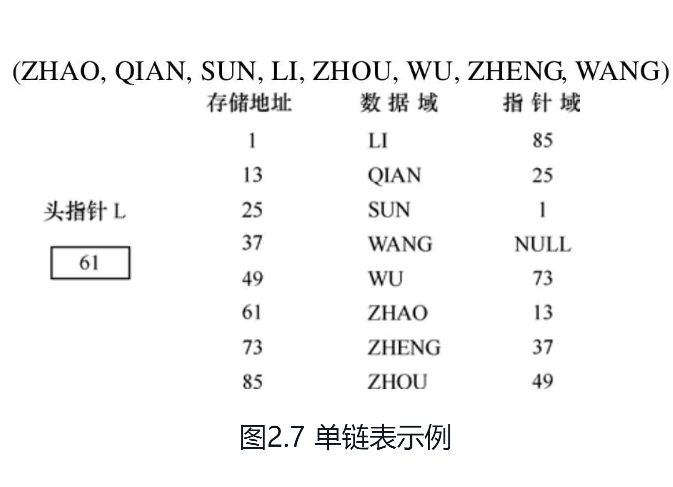

线性表、栈、队列、串和数组都属于线性结构。

线性结构的基本特点是除第一个元素无直接前驱，最后一个元素无直接后继之外，其他每个数据元素都有一个前驱和后继。

线性表是最基本且最常用的一种线性结构，同时也是其他数据结构的基础，尤其单链表，是贯穿整个数据结构课程的基本技术。


## 线性表的定义和特点

由n（n≥0）个数据特性相同的元素构成的有限序列称为**线性表**。

线性表中元素的个数n（n≥0）定义为线性表的长度，n=0时称为**空表**。

对于非空的线性表或线性结构，其特点是：（1）存在唯一的一个被称作“第一个”的数据元素；（2）存在唯一的一个被称作“最后一个”的数据元素；（3）除第一个之外，结构中的每个数据元素均只有一个前驱；（4）除最后一个之外，结构中的每个数据元素均只有一个后继。


## 线性表

### 线性表的顺序存储表示

线性表的顺序表示指的是用一组地址连续的存储单元依次存储线性表的数据元素，这种表示也称作线性表的顺序存储结构或顺序映像。通常，称这种存储结构的线性表为**顺序表（Sequential List）**。

其特点是，逻辑上相邻的数据元素，其物理次序也是相邻的。

每一个数据元素的存储位置都和线性表的起始位置相差一个常数，这个常数和数据元素在线性表中的位序成正比。由此，只要确定了存储线性表的起始位置，线性表中任一数据元素都可随机存取，所以线性表的顺序存储结构是一种**随机存取**的存储结构。


##  顺序表

可以看出，当线性表以上述定义的顺序表表示时，某些操作很容易实现。因为表的长度是顺序表的一个“属性”，所以可以通过返回length的值实现求表长的操作，通过判断length的值是否为0判断表是否为空，这些操作算法的时间复杂度都是$$O(1)$$。下面讨论顺序表其他几个主要操作的实现。


顺序表可以随机存取表中任一元素，其存储位置可用一个简单、直观的公式来表示。然而，从另一方面来看，这个特点也造成了这种存储结构的缺点：在做插入或删除操作时，需移动大量元素。另外由于数组有长度相对固定的静态特性，当表中数据元素个数较多且变化较大时，操作过程相对复杂，必然导致存储空间的浪费。所有这些问题，都可以通过线性表的另一种表示方法——链式存储结构来解决。


## 链表

当我们需要使用动态内存分配来管理数据集合时，链表是一种常用的数据结构。链表由节点构成，每个节点包含数据和指向下一个节点的指针。


线性表链式存储结构的特点是：用一组任意的存储单元存储线性表的数据元素（**这组存储单元可以是连续的，也可以是不连续的**）。因此，为了表示每个数据元素ai与其直接后继数据元素ai+1之间的逻辑关系，对数据元素ai来说，除了存储其本身的信息之外，**还需存储一个指示其直接后继的信息（即直接后继的存储位置）**。这两部分信息组成数据元素ai的存储映像，称为结点（node）。

它包括两个域：其中存储数据元素信息的域称为**数据域**；

存储直接后继存储位置的域称为**指针域**。

指针域中存储的信息称作**指针**或**链**。

n个结点（$$ ai（1≤i≤n）$$的存储映像）链结成一个**链表**，即为线性表
$$
(a1, a2,…, an)
$$
的链式存储结构。又由于此链表的每个结点中只包含一个指针域，故又称**线性链表**或**单链表**。

根据链表结点所含指针个数、指针指向和指针连接方式，可将链表分为单链表、循环链表、双向链表、二叉链表、十字链表、邻接表、邻接多重表等。**其中单链表、循环链表和双向链表用于实现线性表的链式存储结构，其他形式多用于实现树和图等非线性结构。**

本节先讨论单链表，例如，图2.7所示为线性表的单链表存储结构，整个链表的存取必须**从头指针开始进行**，头指针指示链表中**第一个结点**（即第一个数据元素的存储映像，也称首元结点）的存储位置。同时，由于最后一个数据元素没有直接后继，则单链表中**最后一个结点的指针为空（NULL）**。



用单链表表示线性表时，数据元素之间的逻辑关系是由结点中的指针指示的。换句话说，指针为数据元素之间的逻辑关系的映像，则逻辑上相邻的两个数据元素**其存储的物理位置不要求紧邻**，由此，这种存储结构为**非顺序映像或链式映像**。

通常将链表画成用箭头相链接的结点的序列，结点之间的箭头表示链域中的指针。图2.7所示的单链表可画成如图2.8所示的形式，这是因为在使用链表时，关心的只是它所表示的线性表中数据元素之间的逻辑顺序，而不是每个数据元素在存储器中的实际位置。

```c
l->ZHAO->QIAN->SUN->LI->ZHOU->WU->ZHENG->WANG->NULL
```


**ChatGPT：当我们需要使用动态内存分配来管理数据集合时，链表是一种常用的数据结构。链表由节点构成，每个节点包含数据和指向下一个节点的指针。**


### 链表的C实现

在C语言中创建链表并向其中添加数据的基本步骤如下：


注意：在使用完链表后，需要释放链表中每个节点所占用的内存。


#### 释放链表内存

在C语言中释放链表中每个节点所占用的内存的基本步骤如下：

1. 定义一个指向节点的指针变量和一个指向下一个节点的指针变量。

   ```c
   struct node* current = head;
   struct node* next_node = NULL;
   ```

2. 使用循环遍历链表，释放每个节点所占用的内存。在释放每个节点之前，需要将下一个节点的指针保存到next_node变量中，以便在释放当前节点后访问下一个节点。

   ```c
   while (current != NULL) {
       next_node = current->next;
       free(current);
       current = next_node;
   }
   ```

   上面的代码使用while循环遍历链表，释放当前节点所占用的内存，并将指针移动到下一个节点。在循环的每个迭代中，我们将下一个节点的指针保存到next_node变量中，然后释放当前节点的内存，最后将当前节点指向next_node指针所指向的下一个节点。

3. 最后，将链表的头指针设置为NULL，以确保不会在释放内存后继续访问已经释放的节点。

   ```c
   head = NULL;
   ```

   上面的代码将head指针设置为NULL，这意味着链表已经被完全释放。

注意：在使用完链表后，需要释放链表中每个节点所占用的内存，否则会导致内存泄漏。在释放每个节点之前，需要将指向下一个节点的指针保存到另一个变量中，以确保可以在释放当前节点后访问下一个节点。最后，将链表的头指针设置为NULL，以确保不会在释放内存后继续访问已经释放的节点。


**链表的基本操作包括：**

- **在链表头部插入一个节点**

- **在链表尾部插入一个节点**

- **在链表中间插入一个节点**

- **从链表中删除一个节点**

- **在链表中查找一个节点**

  

#### 在链表头部插入一个节点

```c
void insertAtBeginning(struct Node** head_ref, int new_data)
{
    struct Node* new_node = (struct Node*)malloc(sizeof(struct Node));
    new_node->data = new_data;
    new_node->next = (*head_ref);
    (*head_ref) = new_node;
}
```


#### 在链表尾部插入一个节点

```c
// write a function to insert a node at the end of the linked list
void endinsert_node(struct node *head, int data)
{
    struct node *temp = head;
    while (temp->next != NULL)
    {
        temp = temp->next;
    }
    struct node *new_node = (struct node *)malloc(sizeof(struct node));
    new_node->data = data;
    new_node->next = NULL;
    temp->next = new_node;
}

```


#### 在链表中间插入一个节点

```c
void intsert_node_at(struct node *head, int data, int index) 
{
    struct node *temp = head;
    int i = 0;
    while (temp->next != NULL)
    {
        if (i == index)
        {
            struct node *new_node = (struct node *)malloc(sizeof(struct node));
            new_node->data = data;
            new_node->next = temp->next;
            temp->next = new_node;
            break;
        }
        temp = temp->next;
        i++;
    }
}


```


#### 从链表中删除一个节点

```c
void delete_node(struct node *head, int data)
{
    struct node *temp = head;
    while (temp->next != NULL)
    {
        if (temp->next->data == data)
        {
            struct node *next = temp->next->next;
            free(temp->next);
            temp->next = next;
            break;
        }
        temp = temp->next;
    }
}
```


#### 在链表中查找一个节点

```c
void research_node(struct node *head, int data)
{
    struct node *temp = head;
    int i = 0;
    while (temp->next != NULL)
    {
        if (temp->data == data)
        {
            printf("The node is at index %d\n", i);
            break;
        }
        temp = temp->next;
        i++;
        if (temp->next == NULL && temp->data == data)
        {
            printf("The node is at index %d\n", i);
            break;
        }
    }
}


```

这些是链表的基本操作，可以根据需要进行修改和扩展。


**实例：在linked_list.c**


